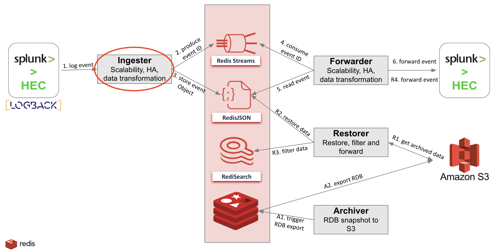

# Splunk-Redis Ingester
The corner stone of our solution is Redis Enterprise. Redis Enterprise is a key-value on-memory database that offers automatic failover and replication to avoid data loss. 
High and linear scalability to provide a tremendous throughput and a very low latency (sub milliseconds) when reading and writing data.
The solution consists of a Redis Enterprise cluster and several components (upstream and downstream of Redis Enterprise):

1. The ingester: following a publisher/subscriber architecture, this module listens to the Splunk agent (intercepts HTTP events) and produces data as JSON documents and put their ID in the `forward` Stream.
To provide scalability, there can be several instances of the ingester behind a load-balancer (haproxy, nginx).
2. The forwarder : this module subscribes to the `forward` stream fed by the ingester module.
For each received event, the forwarder gets the payload from the key and sends it to the Splunk HEC (Http Event Collector).
If the payload is rejected for any reason, the forwarder stores the payload in the dead-letter queue for analysis and delivery retry.
3. The archiver: this module subscribes to the "event" stream and checks that “ingesters” and `forward` streams are empty. Then it triggers an hourly RDB backup to S3.
4. The restorer: on a “restore” message (from Admin API), this module restores one hourly RDB backup from S3 (JSON+Stream), it creates Redis Search indexes (FTSEARCH) and use them with provided filter criteria to UNLINK unwanted items (to keep only the required elements: by user, by host and by Splunk index)

This repository is a lightweight implementation of the Ingester module.



## Usage
Clone the Repository:
```bash
git clone https://github.com/amineelkouhen/redis-splunk-ingester.git
```

You can run the project in your local machine by installing [Redis Stack](https://redis.io/docs/stack/get-started/install/) then running `./gradlew bootRun`.

There is a docker compose script which will bootstrap all the components required to make this demo work.

1. Build the project `./gradlew build`
2. Run `docker-compose up` from the root dir
3. The containers will start in the correct order
4. On startup:
- The Redis Service will bootstrap `Redis-Stack` on port 6379
- The Ingester Service will bootstrap the Splunk-Redis Ingestion Module on Port 8686

```bash
Creating redis-stack-service ... done
Creating ingester-service    ... done
Attaching to redis-stack-service, ingester-service
```

- The Ingester Module will create the forward stream and will catch every request on Port 8686 to store the events
```bash
ingester-service | [main] c.r.s.i.configuration.JedisConfig                   : host redis - port 6379
ingester-service | [main] c.r.s.i.configuration.JedisConfig                   : stream group created: OK
ingester-service | [nio-8686-exec-1] c.r.s.i.storage.service.StoreService     : starting a transaction
ingester-service | [nio-8686-exec-1] c.r.s.i.storage.service.StoreService     : adding object 70af7e91-97b6-48d7-b499-5fdb76b666e5 to stream
ingester-service | [nio-8686-exec-1] c.r.s.i.storage.service.StoreService     : saving object 70af7e91-97b6-48d7-b499-5fdb76b666e5 as JSON
ingester-service | [nio-8686-exec-1] c.r.s.i.storage.service.ProxyService     : transaction done
```

### Software Reqs
- Docker
- Docker Compose
- Java 11+
